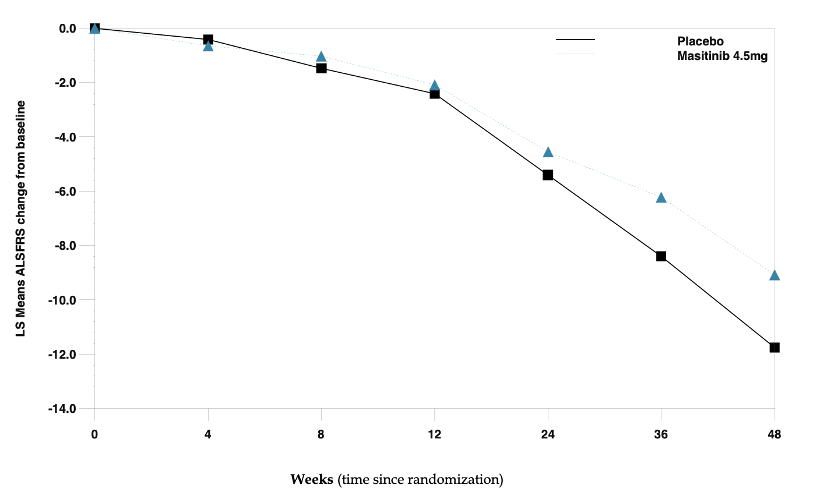

## Science
Masitinib is an oral treatment designed to block the activity of multiple cell types — including macrophages, neutrophils, mast cells, and Schwann cells — involved in the inflammatory and neurodegenerative processes marking ALS. It does so through the activity of proteins called tyrosine kinases.[^1]  

Check [AB Science](https://www.ab-science.com/science/masitinib-in-neurodegenerative-disorders/) page to know more.

[^1]: from [ALS News Today](https://alsnewstoday.com/news-posts/2020/04/03/fda-clears-ab-science-to-open-phase-3-trial-of-masitinib-add-on-als-treatment/)

## Articles
{}

#### [2019 - Add-on Masitinib Slows Progression of ALS, Final Phase 2/3 Trial Results Show](https://www.tandfonline.com/doi/full/10.1080/21678421.2019.1632346)
<a class="btn btn-outline-primary" target="_blank" rel="noopener noreferrer" href="./masitinib_as_an_add_on_therapy_to_riluzole_in_patients_with_als.pdf">Download PDF</a>  
> Masitinib in combination with Rilutek (riluzole) slows functional decline of patients with amyotrophic lateral sclerosis (ALS) who have a typical disease progression, according to the final report of AB Science‘s Phase 2/3 clinical trial.
>
> At 11 months of treatment with the combo, the rate of disability progression was reduced by 27%, as compared to a placebo plus Rilutek. In contrast, patients who have a faster disease worsening do not benefit as much from adding masitinib to their treatment.

