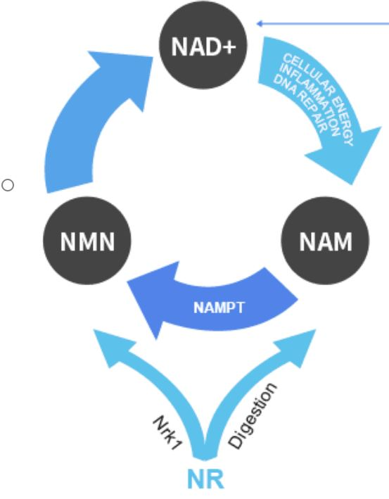

## Science

### What is NAD
Nicotinamide adenine dinucleotide (NAD) is a cofactor central to metabolism. Found in all living cells, NAD is called a dinucleotide because it consists of two nucleotides joined through their phosphate groups. One nucleotide contains an adenine nucleobase and the other nicotinamide. NAD exists in two forms: an oxidized and reduced form, abbreviated as NAD+ and NADH respectively.[^1]

[...]There are three major functions of NAD. First, it allows us to convert our food into ATP, which is the biological chemical currency that allows us to move our muscles, have ideas, and run all of our cells. Second, NAD also catalyzes conversion of the food we eat into everything we are, including DNA, RNA, proteins, hormones and lipids. Third, NAD helps us to repair cellular damage to DNA, protein and fat that is caused by the way we live our lives, what we eat or drink, how we sleep, travel, sun, the air we breath, stress and just plain old wear-and-tear. [^2]

[^1]: https://en.wikipedia.org/wiki/Nicotinamide_adenine_dinucleotide
[^2]: https://www.foodmatterslive.com/news-and-comment/news/chromadex-nad

### What are NMN, NA and NR?
Nicotinamide or Niacinamide (NAM)
Nicotinamide mononucleotide (NMN)
Nicotinic Acid or Niacin (NA)  
NR (Nicotinamide Riboside) 

are all precursors of NAD

## Articles
{}

### NR
> Patented by ChromaDex, sold under TruNiagen. Could also be found in Elysium Health 'Basis' product though manufacturer is unknown at the time of writing.

#### [Evaluation of the NAD+ biosynthetic pathway in ALS patients and effect of modulating NAD+ levels in hSOD1-linked ALS mouse models](https://www.sciencedirect.com/science/article/pii/S0014488620300509?via%3Dihub)
<a class="btn btn-outline-primary" target="_blank" rel="noopener noreferrer" href="./evalutaion_of_the_nad+_biosynthetic_pathways_in_als_patient.pdf">Download PDF</a> 

#### EH301 - NR + PT (pterostilbene)
* 19 Feb 2019  
  [University of Valencia Research Reveals that eH301 May Halt ALS Progression](https://www.trialsitenews.com/university-of-valencia-research-reveals-that-eh301-may-halt-als-progression/)
* 18 Feb 2019
  [In Small Trial, EH301 Appears to Halt Progression of ALS](https://www.alzforum.org/news/research-news/small-trial-eh301-appears-halt-progression-als)
* **PDF - Jan 2019**
  [Efficacy and tolerability of EH301 for amyotrophic lateral sclerosis: a randomized, double-blind, placebo-controlled human pilot study](./eh301_study.pdf)
* 3 Apr 2018
  [Elysium Health’s EH301 Designated Orphan Drug by FDA for Treatment of ALS](https://alsnewstoday.com/2018/04/03/eh301-granted-orphan-drug-designation-amyotrophic-lateral-sclerosis/) 

### NMN

#### [NMN as a potential therapeutic agent for muscle disease](https://www.nmn.com/news/nmn-as-potential-therapeutic-agent-for-muscle-disease)

#### [Enhancing NAD+ Salvage Pathway Reverts the Toxicity of Primary Astrocytes Expressing Amyotrophic Lateral Sclerosis-linked Mutant Superoxide Dismutase 1 (SOD1)](https://www.ncbi.nlm.nih.gov/pubmed/27002158)

